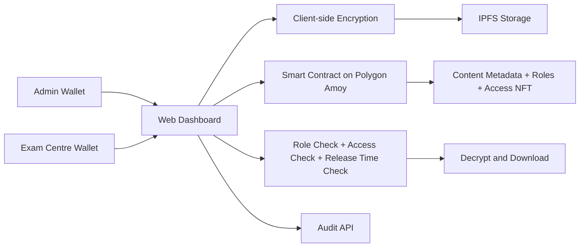

<div align="center">

# National ExamChain
### Secure, Role-Based Exam Paper Distribution with Encryption + Blockchain

<!-- replace with actual logo -->


</div>

---

## 📸 Demo / Preview

<!-- replace with actual gif -->


<!-- replace with actual screenshots -->
| Admin Publishing | Centre Vault |
|---|---|
|  |  |

---

## 🧠 Problem Statement

Exam paper handling in traditional systems is vulnerable to:

- Premature paper leaks before official release
- Weak access control across institutions and centers
- Difficult auditability of who uploaded, approved, or accessed what
- Heavy dependence on trust-based manual workflows

For high-stakes exams, this creates operational, legal, and reputational risk.

---

## 💡 Solution / Idea

National ExamChain combines client-side encryption, decentralized storage, and on-chain role/access control to create a tamper-resistant exam distribution pipeline.

Core model:

- Papers are encrypted before upload
- Encrypted payloads are stored on IPFS
- Access and release metadata are managed by smart contracts
- Only authorized wallets can unlock at the right time
- Every critical action leaves an auditable trace

---

## ✨ Features

### Admin Workflow
- Secure paper upload with release-time scheduling
- Content registration on Polygon Amoy
- Grant access to centers using NFT-based authorization
- Real-time transaction feedback and audit visibility

### Examination Centre Workflow
- Role-gated dashboard (only relevant panel shown)
- Access to assigned papers only
- Time-locked download enforcement
- Decryption key validation before file unlock

### Platform Strengths
- Role-based access control (admin vs exam centre)
- End-to-end traceability (uploads, grants, access attempts)
- Resilient UX for long IDs, RPC throttling, and wallet changes
- Production-ready build with strict type-safe frontend stack

---

## 🛠 Tech Stack

### Frontend
- Next.js 14
- React 18
- TypeScript
- Tailwind CSS
- Framer Motion

### Web3
- Solidity (smart contracts)
- Hardhat
- Viem
- Wagmi
- RainbowKit
- Polygon Amoy testnet

### Storage & Data
- IPFS (Pinata)
- Prisma (for audit metadata)
- SQLite (local/dev audit persistence)

---

## 🏗 Architecture Overview

<!-- replace with actual architecture diagram -->




---

## ⚙️ Installation & Setup

### 1) Clone Repository
```bash
git clone https://github.com/swapnilyt1234/NATIONAL-EXAMCHAIN-RABBIT-AI.git
cd NATIONAL-EXAMCHAIN-RABBIT-AI/edtech-dapp
```

### 2) Install Dependencies
```bash
npm install
```

### 3) Configure Environment
Create `.env.local` with required variables:

```env
NEXT_PUBLIC_EDU_CONTRACT_ADDRESS=YOUR_CONTRACT_ADDRESS
NEXT_PUBLIC_WALLETCONNECT_PROJECT_ID=YOUR_WALLETCONNECT_ID
NEXT_PUBLIC_PINATA_JWT=YOUR_PINATA_JWT
NEXT_PUBLIC_PINATA_API_KEY=YOUR_PINATA_API_KEY
NEXT_PUBLIC_PINATA_SECRET=YOUR_PINATA_SECRET

AMOY_RPC_URL=YOUR_AMOY_RPC_URL
MUMBAI_RPC_URL=YOUR_MUMBAI_RPC_URL
DEPLOYER_PRIVATE_KEY=YOUR_DEPLOYER_PRIVATE_KEY
CONTRACT_ADDRESS=YOUR_CONTRACT_ADDRESS

ADMIN_WALLETS=comma,separated,admin,wallets
EXAM_CENTER_WALLETS=comma,separated,centre,wallets
STUDENT_WALLETS=comma,separated,student,wallets
```

> Never commit secrets or private keys.

### 4) Start Development Server
```bash
npm run dev
```

### 5) Optional Contract Commands
```bash
npm run compile
npm run deploy:amoy
npm run grant:roles -- --network amoy
npm run addresses -- --network amoy
```

---

## ▶️ Usage Instructions

### Admin Flow
1. Connect admin wallet
2. Upload exam paper and set release time
3. Note generated Content ID
4. Grant access to an exam centre wallet
5. Share decryption key securely with authorized centre

### Exam Centre Flow
1. Connect centre wallet
2. Open Centre Vault
3. View assigned papers
4. After release time, provide decryption key
5. Download and decrypt paper

---

## 📂 Folder Structure

```text
NATIONAL-EXAMCHAIN/
└── edtech-dapp/
		├── app/
		│   ├── api/
		│   │   └── audit/
		│   ├── dashboard/
		│   ├── globals.css
		│   ├── layout.tsx
		│   └── providers.tsx
		├── components/
		│   ├── dashboard-layout.tsx
		│   ├── teacher-upload.tsx
		│   ├── student-vault.tsx
		│   └── ui/
		├── contracts/
		│   └── EduAccessControl.sol
		├── hooks/
		│   └── useEduContract.ts
		├── lib/
		│   ├── contract.ts
		│   ├── encryption.ts
		│   ├── ipfs.ts
		│   └── prisma.ts
		├── scripts/
		│   ├── deploy.js
		│   ├── grant-roles.js
		│   └── show-addresses.js
		├── test/
		├── prisma/
		├── public/
		└── README.md
```

---

## 🔐 Security / Special Features

- Client-side encryption before network transmission
- Role-based smart contract gating for critical operations
- Time-locked content release to prevent early access
- Wallet-specific access grants for controlled distribution
- Audit-ready activity logs for uploads and accesses
- Improved failure UX for RPC limits and invalid schedule timing

---

## 🌐 Future Scope / Roadmap

- Multi-board / multi-tenant governance support
- Threshold approvals for high-sensitivity papers
- ZK-based verification for key ownership/access proofs
- Dedicated observability panel for chain + API health
- Revocation and emergency lockdown workflows
- Mainnet hardening and compliance-grade reporting exports

---

## 🤝 Contributing Guidelines

Contributions are welcome.

1. Fork the repository
2. Create a feature branch
3. Commit with clear messages
4. Add or update tests where relevant
5. Open a pull request with context and screenshots

Please keep PRs focused, reviewed, and reproducible.

---

## 📜 License

This project is licensed under the MIT License.

See `LICENSE` for details.

---

## 🙌 Acknowledgements

- OpenZeppelin for secure access control and token standards
- Polygon ecosystem tooling and testnet infrastructure
- Viem, Wagmi, and RainbowKit maintainers
- Next.js and React communities
- IPFS/Pinata ecosystem for decentralized storage

---

## 📬 Contact / Links

- GitHub: https://github.com/swapnilyt1234/NATIONAL-EXAMCHAIN-RABBIT-AI
- Issues: https://github.com/swapnilyt1234/NATIONAL-EXAMCHAIN-RABBIT-AI/issues
- Demo (replace): https://national-examchain.vercel.app/

---

<div align="center">
	<b>National ExamChain</b><br/>
	Building trust in exam distribution through encryption + verifiable access.
</div>
"# NATIONAL-EXAMCHAIN-RABBIT-AI" 
